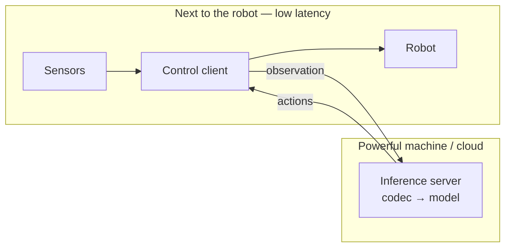
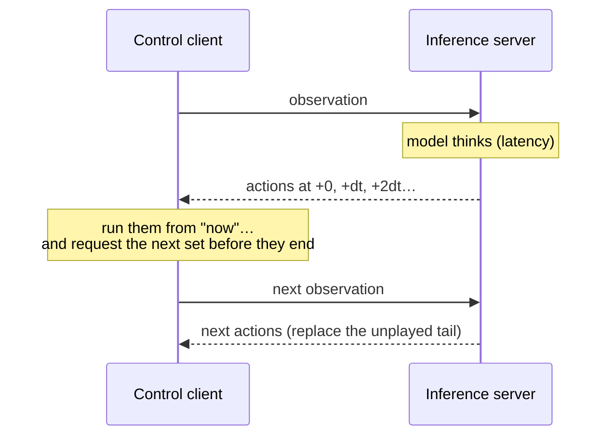

# Connect Your Model

Positronic lets any robot run any policy over one WebSocket protocol. A trained model runs as a server; the robot — or a simulator — runs a client that streams observations to it and executes the actions it returns. This guide explains how that split works and how to plug in your own model.

**What you need:** [uv](https://docs.astral.sh/uv/) and a clone of the repo (`git clone git@github.com:Positronic-Robotics/positronic.git`). Docker is optional — it is only a convenient way to get a vendor model's Python dependencies; the server itself is an ordinary webserver you can also run from a checkout.

## Run the demo

The quickest way to see the whole system is a public ACT checkpoint trained on a simulated cube-stacking task.

Start the server (downloads a ~480 MB checkpoint, then serves on port 8000):

```bash
cd docker && docker compose run --rm --service-ports lerobot-0_3_3-server demo
```

Check it is ready:

```bash
curl http://localhost:8000/api/v1/models
# {"models": ["050000"]}
```

In a separate terminal, run inference inside the simulation:

```bash
uv run positronic eval run --eval=.sim.positronic.stack_cubes \
  --policy=.remote --policy.host=localhost --policy.port=8000 \
  --show_gui=True \
  --output_dir=~/datasets/demo_run
```

A UI window shows the robot arm executing the policy. `--output_dir` records every episode (robot state, camera feeds, actions); browse them with:

```bash
uv run positronic-server --dataset.path=~/datasets/demo_run --port=5001
# open http://localhost:5001
```

## How inference works

To control a robot well, the control loop must run on a machine right next to it — every millisecond of delay to the motors matters. But modern policies are large and need a powerful GPU, which usually lives elsewhere: another box on the network, or the cloud. So Positronic splits the system in two:

- an **inference server** that holds the model and, given an observation, returns actions;
- a **control client** that runs next to the robot, reads sensors, sends observations to the server, and drives the motors with what comes back.



The split introduces a delay: the model takes time to think, and the network adds more. **Something has to decide what the robot does during that delay, and how each new batch of predictions blends with the motion already underway.** That decision is yours, and it has to live on the client — the only part fast enough to be in the loop with the robot. That is why there is client-side code at all, and not just a model endpoint.

Two consequences shape the API:

**The server usually returns a whole trajectory, not one target.** A server *can* return a single destination for the robot, but in practice a model returns a short stretch of upcoming motion at once. The client executes that trajectory while it requests the next prediction, so the robot keeps moving instead of stalling between requests. When new actions arrive, they replace the part of the trajectory not yet executed.

**Each action says when to run.** The actions come tagged with a time offset in seconds, measured from the start of the returned trajectory. The client lays them on its own timeline the moment the prediction arrives and runs each one at its offset. Because the client times everything from when the answer came back, the model never has to know about network or compute delay.



How the client fills the delay and merges successive predictions is a swappable choice. The default runs each trajectory to its end, then asks for the next. More advanced strategies — temporal ensembling ([Zhao et al. 2023](https://arxiv.org/abs/2304.13705)) and real-time chunking ([Black et al. 2025](https://arxiv.org/abs/2506.07339)) — overlap and blend predictions to stay smooth under latency. They all talk to the same server; only the client logic changes.

## The pieces

Four small concepts make up the API. You meet them whether you use a built-in server or write your own.

**Policy and Session.** A `Policy` is your loaded model: it holds the weights and knows how to start an episode. `policy.new_session()` begins one episode and returns a `Session`. You call the session once per timestep with the latest observation, and it returns the next actions to run. Per-episode state (history, the trajectory in flight) lives in the session — so one `Policy` can serve several robots at once, each with its own `Session`.

**Codec.** Different models want different inputs: end-effector pose vs joint angles, absolute targets vs deltas, 224×224 vs 512×512 images. A `Codec` translates between the robot's raw data (what is on the wire) and your model's format — `encode` on the way in, `decode` on the way out. The same codec prepares the training data, so a model is served exactly the way it was trained. The full catalog is in the [Codecs Guide](codecs.md).

**Wrapper.** A `PolicyWrapper` is the swappable client-side logic from the previous section — scheduling, error recovery, recording. Wrappers compose with `|` and wrap a policy, so you can change *how* latency is handled without touching the model.

## The wire format

This is the concrete data crossing the WebSocket. Every message is [msgpack](https://msgpack.org/) with numpy array support (see [Serialization](#serialization)).

### Observation (client → server)

The client sends the full raw robot state as a dict. Keys are flat strings (the dots are literal, not nesting):

| Key | Type | Shape | Description |
|-----|------|-------|-------------|
| `robot_state.ee_pose` | float32 | (7,) | End-effector pose: `x, y, z, qw, qx, qy, qz` (quaternion is **wxyz**, scalar first) |
| `robot_state.q` | float32 | (7,) | Joint positions (radians) |
| `robot_state.dq` | float32 | (7,) | Joint velocities (radians/s) |
| `grip` | float32 | scalar | Gripper opening |
| `image.<name>` | uint8 | (H, W, 3) | Camera RGB. Stream names come from the run config — sim and PhAIL send `image.exterior` and `image.wrist` (sim also adds `image.agent_view`) |
| `inference_time_ns` | int | scalar | Inference-clock timestamp of this observation (ns) |
| `wall_time_ns` | int | scalar | Wall-clock timestamp (ns) |
| `task` | str | — | Language instruction for the episode |
| `descriptor` | str | — | Embodiment the observation came from (e.g. `mujoco.franka`); empty string when unset. Lets a multi-embodiment policy adapt to the current robot |

Your server receives every key each step. Use what your model needs and ignore the rest. Image stream names are configuration-driven, so key off the names your deployment uses rather than assuming fixed ones.

### Actions (server → client)

The normal response is a list of action dicts — a short trajectory. (A single action dict is also valid; what matters is that the client-side wrappers and the server, taken together, produce actions carrying the fields below.)

```python
{"result": [
    {"robot_command": {...}, "target_grip": 0.04, "timestamp": 0.0},
    {"robot_command": {...}, "target_grip": 0.04, "timestamp": 0.066},
    ...
]}
```

| Field | Type | Description |
|-------|------|-------------|
| `robot_command` | dict | Control command (see below) |
| `target_grip` | float | Target gripper opening |
| `timestamp` | float | Execution time in seconds from the start of the returned trajectory (e.g. `i / action_fps` for the i-th action). The client runs each action at `now + timestamp`, where `now` is when the prediction arrived. A single action dict returned *outside* a list is auto-stamped `0.0`; give every action in a list its own `timestamp`, or they all collapse onto one instant and fire at once. |

The `robot_command` field selects the control mode:

| Command type | Fields | Description |
|--------------|--------|-------------|
| `cartesian_pos` | `pose`: float32 (12,) | Target EE pose: 3 translation + 9 flattened rotation matrix (row-major) |
| `joint_pos` | `positions`: float32 (7,) | Target joint angles (radians) |
| `joint_delta` | `velocities`: float32 (7,) | Joint velocity command |

Which command type your model produces is decided by its codec.

## Debugging with recordings

When a run doesn't produce the result you expected, it helps to record exactly what crossed the boundaries between the robot, the codec, and the model. Recording is itself a policy wrapper — `Recorder` in [`positronic/policy/recording.py`](../positronic/policy/recording.py) — that taps into any client pipeline; the built-in servers expose it via `--recording_dir`. It writes one [rerun](https://rerun.io) file per episode with two layers:

- **`raw`** — the observation and action as they appear on the wire.
- **`inference`** — the same episode *after* the codec: the encoded observation the model received and the raw actions it produced.

Comparing the two localizes the fault: if `raw` looks right but `inference` looks wrong, the codec is at fault; if the `inference` input looks right but the output is bad, it is the model.

The client side can record too: `--output_dir` saves the full episode as a Positronic dataset, browsable with `positronic-server`.

## Implement your own server

To connect a custom model you implement this WebSocket protocol. The full low-level spec — endpoints, handshake, status messages — is in the [Offboard README](../positronic/offboard/README.md); the rest of this section shows the shortcut for Positronic-based servers.

### Fast-loading, in-process models

Provide a `Policy` to `InferenceServer`. The server downloads nothing and loads in-process, so it assumes loading is quick (under ~20 s) — otherwise the WebSocket handshake times out before the model is ready.

```python
from positronic.offboard.basic_server import InferenceServer
from positronic.policy import Policy, Session


class MySession(Session):
    def __init__(self, model):
        self._model = model

    def __call__(self, obs):
        # obs holds the raw keys from the wire table above. Pick what you need:
        images = obs['image.exterior']
        ee = obs['robot_state.ee_pose']
        predicted_poses = self._model.predict(images, ee)
        # Return the actions to run: a list of wire-format dicts.
        return [
            {'robot_command': {'type': 'cartesian_pos', 'pose': pose}, 'target_grip': 0.04}
            for pose in predicted_poses
        ]


class MyPolicy(Policy):
    def __init__(self, model):
        self._model = model

    def new_session(self, context=None):
        return MySession(self._model)  # per-episode setup goes here

    @property
    def meta(self):
        return {'type': 'my_model'}


InferenceServer(
    policy_registry={'default': lambda: MyPolicy(load_my_model())},
    host='0.0.0.0',
    port=8000,
).serve()
```

If you give your `Policy` a `Codec` (via `codec.wrap(policy)`), your session works entirely in *model space* — it receives encoded observations and returns model-native actions, and the codec handles the wire format. Test the server with the same client as the demo:

```bash
uv run positronic eval run --eval=.sim.positronic.stack_cubes --policy=.remote --policy.host=localhost --policy.port=8000
```

### Slow-loading or subprocess models

The built-in OpenPI and GR00T servers don't use `InferenceServer` — checkpoints take minutes to download or run as a separate process. They subclass `VendorServer` (`positronic/offboard/vendor_server.py`), which streams `{"status": "loading", ...}` messages so the handshake doesn't time out, owns the codec boundary, and handles multi-model switching, the `recording_dir` taps above, and idle shutdown. Subclasses implement `resolve_model()`, `create_policy()`, and `get_models()`; see `positronic/vendors/openpi/server.py` and `positronic/vendors/gr00t/server.py`.

### Serialization

Every message is msgpack. Numpy arrays use a custom extension:

```python
# numpy array -> msgpack
{
    b"__ndarray__": True,
    b"data": array.tobytes(),   # raw bytes
    b"dtype": str(array.dtype), # e.g. "<f4"
    b"shape": array.shape       # tuple
}
```

`positronic.utils.serialization` provides `serialise()` / `deserialise()` that handle this for you:

```python
from positronic.utils.serialization import serialise, deserialise

session = policy.new_session()           # one Session per episode/connection
async for message in websocket.iter_bytes():
    obs = deserialise(message)           # dict with numpy arrays
    actions = session(obs)               # list of action dicts (or None)
    await websocket.send_bytes(serialise({"result": actions}))
```

If you would rather not depend on Positronic, implement the protocol directly — the only hard requirement is msgpack with numpy support.

## See Also

- [Offboard Protocol](../positronic/offboard/README.md) – full Protocol v1 specification
- [Codecs Guide](codecs.md) – all available codecs by vendor
- [Inference Guide](inference.md) – local and remote inference patterns
- [Training Workflow](training-workflow.md) – training with public datasets
