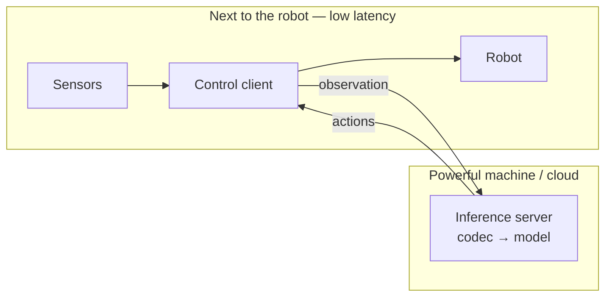
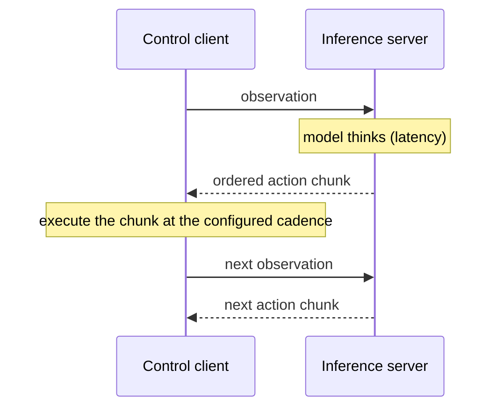

# Connect Your Model

Positronic lets any robot run any policy over one protocol, which a WebSocket or a gRPC wire carries. A trained model runs as a server; the robot — or a simulator — runs a client that streams observations to it and executes the actions it returns.

**What you need:** [uv](https://docs.astral.sh/uv/) and a clone of the repo (`git clone git@github.com:Positronic-Robotics/positronic.git`). Docker is optional — it is only a convenient way to get a vendor model's Python dependencies; the server itself is an ordinary webserver you can also run from a checkout.

## Run the demo

The quickest way to see the whole system is a public ACT checkpoint trained on a simulated cube-stacking task.

Start the server (downloads a ~480 MB checkpoint, then serves on port 8000):

```bash
cd docker && docker compose run --rm --service-ports lerobot-0_3_3-server demo
```

Check it is ready:

```bash
curl http://localhost:8000/api/v1/models
# {"models": ["050000"]}
```

In a separate terminal, run inference inside the simulation:

```bash
uv run positronic eval run --eval=.sim.positronic.stack_cubes \
  --policy=.remote --policy.address.host=localhost --policy.address.port=8000 \
  --output_dir=~/datasets/demo_run
```

The run is headless. `--output_dir` records every episode (robot state, camera feeds, actions); browse them with:

```bash
uv run positronic-server --dataset.path=~/datasets/demo_run --port=5001
# open http://localhost:5001
```

## How inference works

To control a robot well, the control loop must run on a machine right next to it — every millisecond of delay to the motors matters. But modern policies are large and need a powerful GPU, which usually lives elsewhere: another box on the network, or the cloud. So Positronic splits the system in two:

- an **inference server** that holds the model and, given an observation, returns actions;
- a **control client** that runs next to the robot, reads sensors, sends observations to the server, and drives the motors with what comes back.


```mermaid
flowchart LR
    subgraph near["Next to the robot — low latency"]
        sensors[Sensors] --> client[Control client]
        client --> robot[Robot]
    end
    subgraph far["Powerful machine / cloud"]
        server["Inference server<br/>codec → model"]
    end
    client -- "observation" --> server
    server -- "actions" --> client
```

The split introduces a delay: the model takes time to think, and the network adds more. **Something has to decide what the robot does during that delay, and how each new batch of predictions blends with the motion already underway.** That decision is yours, and it has to live on the client — the only part fast enough to be in the loop with the robot. That is why there is client-side code at all, and not just a model endpoint.

Two consequences shape the API:

**The server usually returns an ordered action chunk.** A model predicts a short stretch of upcoming motion at once. The client policy decides when to request the next chunk and how to combine predictions with commands already being executed.

**The client scheduler decides when each action runs.** `ChunkedSchedule` uses its configured FPS to space commands, starting when it reads the completed prediction. The model returns ordered actions without timestamps and does not need to account for network or compute delay.


```mermaid
sequenceDiagram
    participant C as Control client
    participant S as Inference server
    C->>S: observation
    Note over S: model thinks (latency)
    S-->>C: ordered action chunk
    Note over C: execute the chunk at the configured cadence
    C->>S: next observation
    S-->>C: next action chunk
```

How the client fills the delay and merges successive predictions is a swappable choice. The default runs each trajectory to its end, then asks for the next. More advanced strategies — temporal ensembling ([Zhao et al. 2023](https://arxiv.org/abs/2304.13705)) and real-time chunking ([Black et al. 2025](https://arxiv.org/abs/2506.07339)) — overlap and blend predictions to stay smooth under latency. They all talk to the same server; only the client logic changes.

## The pieces

A `Policy` is a reusable processor definition. Each episode starts its `run(runtime)`
generator, which receives observations and yields commands plus the next requested
wake-up time. Generator locals hold episode state.

A `Codec` converts observations and actions, and prepares the same features for
training. `Sequential` combines codecs and processors such as `ChunkedSchedule`.
The [Codecs Guide](codecs.md) lists the available conversions.

A server loads callable `Model` objects through a `ModelSource`. A `PolicyDeployment`
packages that source with the client processor stack and an optional server codec.
`RemotePolicy` opens a session and builds the declared stack around the remote call.

## The wire format

A wire carries [msgpack](https://msgpack.org/) messages with numpy array support (see [Serialization](#serialization)).

### Observation (client → server)

The client sends the full raw robot state as a dict. Keys are flat strings (the dots are literal, not nesting):

| Key | Type | Shape | Description |
|-----|------|-------|-------------|
| `robot_state.ee_pose` | float32 | (7,) | End-effector pose: `x, y, z, qw, qx, qy, qz` (quaternion is **wxyz**, scalar first) |
| `robot_state.q` | float32 | (7,) | Joint positions (radians) |
| `robot_state.dq` | float32 | (7,) | Joint velocities (radians/s) |
| `robot_state.status` | int | scalar | The arm's status: `0` available, `1` busy, `3` error. `2` is also accepted and read as available — an arm travelling towards a setpoint still takes commands. The measurements above come on every sample whatever the status; this is what says whether a command you send will reach the arm |
| `grip` | float32 | scalar | Gripper closure in `[0, 1]`: 0 = open, 1 = closed |
| `image.<name>` | uint8 | (H, W, 3) | Camera RGB. Every eval target — PhAIL and each sim — sends `image.exterior` and `image.wrist`, whatever the underlying benchmark calls those cameras, so one codec reads them all; a target with more views adds its own names beside them (the MuJoCo sim adds `image.agent_view`) |
| `task` | str | — | Language instruction for the episode |
| `descriptor` | str | — | Embodiment the observation came from (e.g. `mujoco.franka`); empty string when unset. Lets a multi-embodiment policy adapt to the current robot |

Your server receives every key each step. An arm that is faulted or busy still reports where it is and says so in `robot_state.status`; the standard stack puts `StopOnFault` ahead of the model, which answers such a step itself rather than plan against an arm that will not take its commands. Use what your model needs and ignore the rest. Image stream names are configuration-driven, so key off the names your deployment uses rather than assuming fixed ones. The table above is a single-arm rig; a multi-arm one names its state and grip channels per arm.

### Actions (server → client)

`ChunkedSchedule` expects a list of action dicts, including a one-item list for a single action. Other client processors may accept different response shapes.

```python
{"result": [
    {"robot_command": CartesianPosition(pose=...), "target_grip": 1.0},
    {"robot_command": CartesianPosition(pose=...), "target_grip": 1.0},
    ...
]}
```

| Field | Type | Description |
|-------|------|-------------|
| `robot_command` | command object | Control command (see below) |
| `target_grip` | float | Target gripper closure in `[0, 1]`: 0 = open, 1 = closed |

The `robot_command` field says what the arm is asked to do. Build one of the commands in
[`positronic.drivers.roboarm.command`](../positronic/drivers/roboarm/command.py):

| Command | Fields | Description |
|---------|--------|-------------|
| `CartesianPosition` | `pose`: `geom.Transform3D` | Target end-effector pose |
| `JointPosition` | `positions`: float32 (7,) | Target joint angles (radians) |
| `JointDelta` | `velocities`: float32 (7,) | Joint velocity command |
| `CartesianDelta` | `delta`, `frame`: `geom.Transform3D` | Relative motion, composed onto the pose the arm is at when it lands; `frame` is the frame `delta` is expressed in |

Every command also takes an optional `mode`, the control law it asks to execute under:
`PositionControl(stiffness=...)` for a position servo, or `Impedance(kq, kqd, kx, kxd)` for the hybrid
joint/Cartesian law. Omit it — the default — and the arm runs its native law. What a pinned mode does is the
driver's: a simulator runs its own law regardless, and a driver that cannot execute the mode raises.
A server built on positronic sets the mode with the `SetControlMode` codec, composed left of the action
decoder; `codecs.droid_execution` and `codecs.phail_v1_execution` wrap an action codec that way. See
[Control mode](codecs.md#control-mode) in the Codec Guide.

Which command your model produces is decided by its codec.

A rig with more than one arm names every channel after the arm that owns it: observations arrive as
`robot_state.left.ee_pose` and `grip.left`, and an action carries `robot_command.left` alongside
`target_grip.left`. An arm your action omits holds its last command.

## Debugging with recordings

Pass `--output_dir` on the client to save the full episode as a Positronic dataset, browsable with `positronic-server`.

## Implement your own server

To connect a custom model you implement this protocol. The full low-level spec — endpoints, handshake, status messages — is in the [Offboard README](../positronic/offboard/README.md). A server built on Positronic takes the shortcut below instead.

### Models and deployments

Implement `Model` and `ModelSource`, then pass a deployment to `PolicyServer`:

```python
from positronic import keys
from positronic.drivers.roboarm import command
from positronic.offboard.server import PolicyServer
from positronic.offboard.server_wire import ServedHostPort
from positronic.offboard.spec import Model, ModelSource, PolicyDeployment
from positronic.offboard.websocket_wire import WebsocketWire
from positronic.policy import Sequential
from positronic.policy.layers import ChunkedSchedule, StopOnFault


class MyModel(Model):
    def __init__(self, weights):
        self.weights = weights

    def __call__(self, obs, *, session_id):
        poses = self.weights.predict(obs[keys.EXTERIOR_IMAGE], obs[keys.EE_POSE])
        return [
            {keys.ROBOT_COMMAND: command.CartesianPosition(pose), keys.TARGET_GRIP: 0.0}
            for pose in poses
        ]

    def meta(self):
        return {'type': 'my_model'}


class MySource(ModelSource):
    def get_models(self):
        return ['default']

    def load(self, model_id, on_progress=None):
        return MyModel(load_my_weights())  # supply your checkpoint loader


deployment = PolicyDeployment(
    source=MySource(),
    local=Sequential(StopOnFault(), ChunkedSchedule(fps=15)),
)
server = PolicyServer(deployment)
server.serve([WebsocketWire(ServedHostPort('0.0.0.0', 8000))])
```

Return a full ordered chunk, with no timestamp entries. The client scheduler owns
cadence and the execution horizon. Add a server codec with `codec=your_codec` if
the model takes encoded inputs and returns model-native outputs. Client codecs
belong in `local`, where they can mix with processors. For example,
`RestrictImageSize(224, 224)` before the remote call limits upload volume.
`compress_images=True` on the deployment enables JPEG transport compression.

The server calls `load` off the event loop and forwards progress messages during
slow downloads or subprocess startup. The loaded model owns those resources and
releases them in `close()`. See the OpenPI and GR00T adapters for examples.

The server supplies `session_id` on every call. A stateless model may ignore it;
a stateful model must keep episodes separate or reject another active owner.
Implement `end_session(session_id)` to release that episode's state. It runs after
outstanding inference finishes, both on explicit session end and on disconnect.
The model remains loaded for subsequent episodes.

Test the deployment with the normal client:

```bash
uv run positronic eval run --eval=.sim.positronic.stack_cubes \
  --policy=.remote --policy.address.host=localhost --policy.address.port=8000
```

### Serialization

Every message is msgpack. Numpy arrays use a custom extension:

```python
# numpy array -> msgpack
{
    b"__ndarray__": True,
    b"data": array.tobytes(),   # raw bytes
    b"dtype": str(array.dtype), # e.g. "<f4"
    b"shape": array.shape       # tuple
}
```

`positronic.offboard.protocol` provides `serialise()` / `deserialise()`, which handle this and the
robot commands:

The session handshake and inference envelopes are defined in the
[Offboard Protocol](../positronic/offboard/README.md). Use `PolicyServer` to handle
session IDs, model loading, cleanup, and errors.

A server written against another stack cannot import that module. Answer with the command as the plain
mapping `positronic.drivers.roboarm.command.to_wire` produces — `{"type": "cartesian_pos", "pose": [...]}`
— under the `robot_command` key, and the client types it on arrival.

## See Also

- [Offboard Protocol](../positronic/offboard/README.md) – full Protocol v1 specification
- [Codecs Guide](codecs.md) – all available codecs by vendor
- [Inference Guide](inference.md) – local and remote inference patterns
- [Training Workflow](training-workflow.md) – training with public datasets
