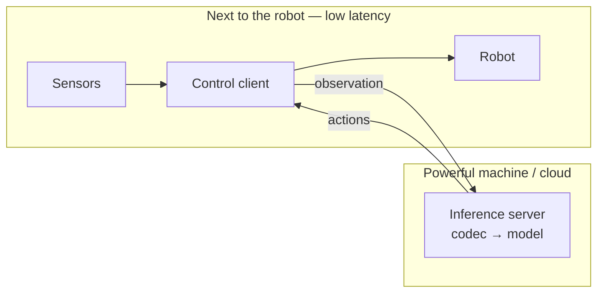
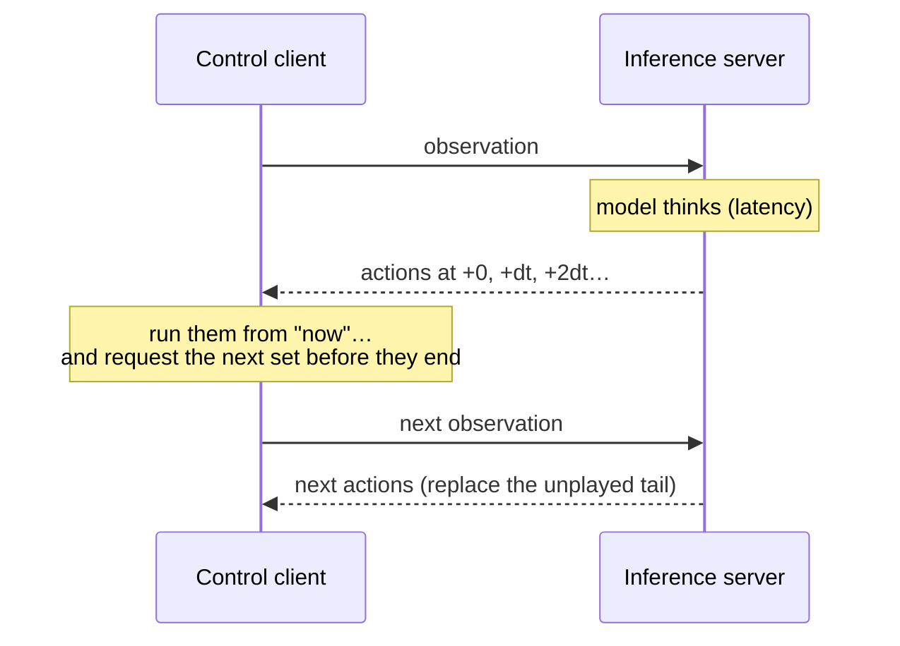

# Connect Your Model

Positronic lets any robot run any policy over one WebSocket protocol. A trained model runs as a server; the robot — or a simulator — runs a client that streams observations to it and executes the actions it returns. This guide explains how that split works and how to plug in your own model.

**What you need:** [uv](https://docs.astral.sh/uv/) and a clone of the repo (`git clone git@github.com:Positronic-Robotics/positronic.git`). Docker is optional — it is only a convenient way to get a vendor model's Python dependencies; the server itself is an ordinary webserver you can also run from a checkout.

## Run the demo

The quickest way to see the whole system is a public ACT checkpoint trained on a simulated cube-stacking task.

Start the server (downloads a ~480 MB checkpoint, then serves on port 8000):

```bash
cd docker && docker compose run --rm --service-ports lerobot-0_3_3-server demo
```

Check it is ready:

```bash
curl http://localhost:8000/api/v1/models
# {"models": ["050000"]}
```

In a separate terminal, run inference inside the simulation:

```bash
uv run positronic eval run --eval=.sim.positronic.stack_cubes \
  --policy=.remote --policy.url=localhost:8000 \
  --output_dir=~/datasets/demo_run
```

The run is headless. `--output_dir` records every episode (robot state, camera feeds, actions); browse them with:

```bash
uv run positronic-server --dataset.path=~/datasets/demo_run --port=5001
# open http://localhost:5001
```

## How inference works

To control a robot well, the control loop must run on a machine right next to it — every millisecond of delay to the motors matters. But modern policies are large and need a powerful GPU, which usually lives elsewhere: another box on the network, or the cloud. So Positronic splits the system in two:

- an **inference server** that holds the model and, given an observation, returns actions;
- a **control client** that runs next to the robot, reads sensors, sends observations to the server, and drives the motors with what comes back.


```mermaid
flowchart LR
    subgraph near["Next to the robot — low latency"]
        sensors[Sensors] --> client[Control client]
        client --> robot[Robot]
    end
    subgraph far["Powerful machine / cloud"]
        server["Inference server<br/>codec → model"]
    end
    client -- "observation" --> server
    server -- "actions" --> client
```

The split introduces a delay: the model takes time to think, and the network adds more. **Something has to decide what the robot does during that delay, and how each new batch of predictions blends with the motion already underway.** That decision is yours, and it has to live on the client — the only part fast enough to be in the loop with the robot. That is why there is client-side code at all, and not just a model endpoint.

Two consequences shape the API:

**The server usually returns a whole trajectory, not one target.** A server *can* return a single destination for the robot, but in practice a model returns a short stretch of upcoming motion at once. The client executes that trajectory while it requests the next prediction, so the robot keeps moving instead of stalling between requests. When new actions arrive, they replace the part of the trajectory not yet executed.

**Each action says when to run.** The actions come tagged with a time offset in seconds, measured from the start of the returned trajectory. The client lays them on its own timeline the moment the prediction arrives and runs each one at its offset. Because the client times everything from when the answer came back, the model never has to know about network or compute delay.


```mermaid
sequenceDiagram
    participant C as Control client
    participant S as Inference server
    C->>S: observation
    Note over S: model thinks (latency)
    S-->>C: actions at +0, +dt, +2dt…
    Note over C: run them from "now"…<br/>and request the next set before they end
    C->>S: next observation
    S-->>C: next actions (replace the unplayed tail)
```

How the client fills the delay and merges successive predictions is a swappable choice. The default runs each trajectory to its end, then asks for the next. More advanced strategies — temporal ensembling ([Zhao et al. 2023](https://arxiv.org/abs/2304.13705)) and real-time chunking ([Black et al. 2025](https://arxiv.org/abs/2506.07339)) — overlap and blend predictions to stay smooth under latency. They all talk to the same server; only the client logic changes.

## The pieces

Four small concepts make up the API. You meet them whether you use a built-in server or write your own.

**Policy and Session.** A `Policy` is your loaded model: it holds the weights and knows how to start an episode. `policy.new_session()` begins one episode and returns a `Session`. You call the session once per timestep with the latest observation and your clock reading, and it returns the next actions to run. Per-episode state (history, the trajectory in flight) lives in the session — so one `Policy` can serve several robots at once, each with its own `Session`.

**Codec.** Different models want different inputs: end-effector pose vs joint angles, absolute targets vs deltas, 224×224 vs 512×512 images. A `Codec` translates between the robot's raw data (what is on the wire) and your model's format — `encode` on the way in, `decode` on the way out. The same codec prepares the training data, so a model is served exactly the way it was trained. The full catalog is in the [Codecs Guide](codecs.md).

**Layer.** A `Layer` is the swappable client-side logic from the previous section — scheduling, error recovery, recording. Layers compose with `|` and wrap a policy, so you can change *how* latency is handled without touching the model. A policy pipeline names the layers together with the codec as one chain split by the `remote` marker and closed by a *model source* — the server-side terminal that loads the model (`local | remote | codec | source`, see `positronic.policy.spec`). The server declares the local half in its handshake and the client builds it, so both halves ship as one pipeline.

## The wire format

This is the concrete data crossing the WebSocket. Every message is [msgpack](https://msgpack.org/) with numpy array support (see [Serialization](#serialization)).

### Observation (client → server)

The client sends the full raw robot state as a dict. Keys are flat strings (the dots are literal, not nesting):

| Key | Type | Shape | Description |
|-----|------|-------|-------------|
| `robot_state.ee_pose` | float32 | (7,) | End-effector pose: `x, y, z, qw, qx, qy, qz` (quaternion is **wxyz**, scalar first) |
| `robot_state.q` | float32 | (7,) | Joint positions (radians) |
| `robot_state.dq` | float32 | (7,) | Joint velocities (radians/s) |
| `robot_state.status` | int | scalar | The arm's status: `0` available, `1` busy, `3` error. `2` is also accepted and read as available — an arm travelling towards a setpoint still takes commands. The measurements above come on every sample whatever the status; this is what says whether a command you send will reach the arm |
| `grip` | float32 | scalar | Gripper closure in `[0, 1]`: 0 = open, 1 = closed |
| `image.<name>` | uint8 | (H, W, 3) | Camera RGB. Every eval target — PhAIL and each sim — sends `image.exterior` and `image.wrist`, whatever the underlying benchmark calls those cameras, so one codec reads them all; a target with more views adds its own names beside them (the MuJoCo sim adds `image.agent_view`) |
| `obs_time_ns` | int | scalar | Harness-clock timestamp of this observation (ns) |
| `wall_time_ns` | int | scalar | Wall-clock timestamp (ns) |
| `task` | str | — | Language instruction for the episode |
| `descriptor` | str | — | Embodiment the observation came from (e.g. `mujoco.franka`); empty string when unset. Lets a multi-embodiment policy adapt to the current robot |

Your server receives every key each step. An arm that is faulted or busy still reports where it is and says so in `robot_state.status`; the standard stack puts `StopOnFault` ahead of the model, which answers such a step itself rather than plan against an arm that will not take its commands. Use what your model needs and ignore the rest. Image stream names are configuration-driven, so key off the names your deployment uses rather than assuming fixed ones. The table above is a single-arm rig; a multi-arm one names its state and grip channels per arm.

### Actions (server → client)

The normal response is a list of action dicts — a short trajectory. (A single action dict is also valid; what matters is that the client-side layers and the server, taken together, produce actions carrying the fields below.)

```python
{"result": [
    {"robot_command": CartesianPosition(pose=...), "target_grip": 1.0, "timestamp": 0.0},
    {"robot_command": CartesianPosition(pose=...), "target_grip": 1.0, "timestamp": 0.066},
    ...
]}
```

| Field | Type | Description |
|-------|------|-------------|
| `robot_command` | command object | Control command (see below) |
| `target_grip` | float | Target gripper closure in `[0, 1]`: 0 = open, 1 = closed |
| `timestamp` | float | Execution time in seconds from the start of the returned trajectory (e.g. `i / action_fps` for the i-th action). The client runs each action at the call's `time_ns` in seconds, plus `timestamp`, where `time_ns` is the clock reading it gave to the call that returned the prediction. A single action dict returned *outside* a list is auto-stamped `0.0`; give every action in a list its own `timestamp`, or they all collapse onto one instant and fire at once. |

The `robot_command` field says what the arm is asked to do. Build one of the commands in
[`positronic.drivers.roboarm.command`](../positronic/drivers/roboarm/command.py):

| Command | Fields | Description |
|---------|--------|-------------|
| `CartesianPosition` | `pose`: `geom.Transform3D` | Target end-effector pose |
| `JointPosition` | `positions`: float32 (7,) | Target joint angles (radians) |
| `JointDelta` | `velocities`: float32 (7,) | Joint velocity command |
| `CartesianDelta` | `delta`, `frame`: `geom.Transform3D` | Relative motion, composed onto the pose the arm is at when it lands; `frame` is the frame `delta` is expressed in |

Every command also takes an optional `mode`, the control law it asks to execute under:
`PositionControl(stiffness=...)` for a position servo, or `Impedance(kq, kqd, kx, kxd)` for the hybrid
joint/Cartesian law. Omit it — the default — and the arm runs its native law. What a pinned mode does is the
driver's: a simulator runs its own law regardless, and a driver that cannot execute the mode raises.
A server built on positronic sets the mode with the `SetControlMode` codec, composed left of the action
decoder; `codecs.droid_execution` and `codecs.phail_v1_execution` wrap an action codec that way. See
[Control mode](codecs.md#control-mode) in the Codec Guide.

Which command your model produces is decided by its codec.

A rig with more than one arm names every channel after the arm that owns it: observations arrive as
`robot_state.left.ee_pose` and `grip.left`, and an action carries `robot_command.left` alongside
`target_grip.left`. An arm your action omits holds its last command.

## Debugging with recordings

When a run doesn't produce the result you expected, it helps to record exactly what crossed the boundaries between the robot, the codec, and the model. Recording is itself a policy layer — `Recorder` in [`positronic/policy/recording.py`](../positronic/policy/recording.py) — that taps into any client pipeline; the built-in servers expose it via `--recording_dir`. It writes one [rerun](https://rerun.io) file per episode with two layers:

- **`raw`** — the observation and the action as they cross the wire.
- **`inference`** — the same episode *after* the codec: the encoded observation the model received and the raw actions it produced.

Comparing the two localizes the fault: if `raw` looks right but `inference` looks wrong, the codec is at fault; if the `inference` input looks right but the output is bad, it is the model.

The client side can record too: `--output_dir` saves the full episode as a Positronic dataset, browsable with `positronic-server`.

## Implement your own server

To connect a custom model you implement this WebSocket protocol. The full low-level spec — endpoints, handshake, status messages — is in the [Offboard README](../positronic/offboard/README.md); the rest of this section shows the shortcut for Positronic-based servers.

### Ready, in-process models

Implement a `Policy`, close a pipeline over it with `PolicySource`, and hand the pipeline to `PolicyServer`:

```python
from positronic.drivers.roboarm import command
from positronic.offboard import PolicyServer
from positronic.policy import Policy, Session
from positronic.policy.spec import PolicySource, remote
from positronic.policy.layers import ChunkedSchedule, StopOnFault


class MySession(Session):
    def __init__(self, model):
        self._model = model

    def __call__(self, obs, time_ns):
        # obs holds the raw keys from the wire table above. Pick what you need:
        images = obs['image.exterior']
        ee = obs['robot_state.ee_pose']
        predicted_poses = self._model.predict(images, ee)  # each a geom.Transform3D
        # Return the actions to run, one per predicted step.
        return [
            {'robot_command': command.CartesianPosition(pose=pose), 'target_grip': 0.0}
            for pose in predicted_poses
        ]

    @property
    def meta(self):
        return {'type': 'my_model'}


class MyPolicy(Policy):
    def __init__(self, model):
        self._model = model

    def new_session(self, context=None, rt=None):
        return MySession(self._model)  # per-episode setup goes here


pipeline = StopOnFault() | ChunkedSchedule() | remote | PolicySource(MyPolicy(load_my_model()))
PolicyServer(pipeline, host='0.0.0.0', port=8000).serve()
```

The pipeline reads left to right: everything left of the `remote` marker is the client-side stack the server declares in its handshake (here the standard `StopOnFault` and `ChunkedSchedule`); everything right of it runs on the server. `PolicySource` is the pipeline's terminal — a model source that serves one already-built policy.

The left side is not optional: a pipeline with nothing there is refused when the server starts, and a rig refuses a handshake that declares nothing. It needs a scheduler in particular, and `StopOnFault` outside that scheduler — an arm that is faulted or busy is not taking the plan it was given, so the layer answers the empty trajectory and the rig stops rather than resuming a chunk stamped before. Actions come back timestamped relative to their chunk, and `ChunkedSchedule` is what turns those into times on the rig's clock; a stack that leaves them relative — or anchors them twice — makes the harness reject the chunk at the first inference, since it schedules nothing more than `MAX_ACTION_SKEW_SEC` from now.

The session's `time_ns` argument is the caller's clock reading in nanoseconds, the same unit the observation's `obs_time_ns` carries. A session reads no clock of its own, and a policy that schedules nothing accepts the value and ignores it.

If you put a `Codec` right of the marker (`ChunkedSchedule() | remote | codec | PolicySource(...)`), your session works entirely in *model space* — it receives encoded observations and returns model-native actions, and the codec handles the wire format. A codec that encodes images should also bound them on the rig, so full-resolution frames never cross the wire — that is what the built-in vendor pipelines do:

```python
StopOnFault() | ChunkedSchedule() | RestrictImageSize() | remote | codec | source
```

Give it the geometry your codec encodes to — `RestrictImageSize(224, 224)` for a 224x224 model — so a frame is shrunk once, on the rig. The default is a loose 640x640, for a codec that resizes to nothing in particular. Leaving it out costs bandwidth, not correctness.

If your server sits behind a proxy that caps message size (Modal's is ~2 MB), write `remote(compress_images=True)` instead of the bare marker: the rig then JPEG-encodes frames before sending. That is the marker's own setting because it describes the wire, not the policy — and the rig can't know what fronts your server, so the server declares it.

Test the server with the same client as the demo:

```bash
uv run positronic eval run --eval=.sim.positronic.stack_cubes \
  --policy=.remote --policy.url=localhost:8000
```

### Slow-loading or subprocess models

The built-in OpenPI and GR00T servers can't hand over a ready policy — checkpoints take minutes to download or run as a separate process. Instead of `PolicySource` they implement their own `ModelSource` (`positronic/policy/spec.py`), the terminal that turns checkpoint ids into policies: `get_models()` lists the ids, `resolve()` maps a request (or the default) to one of them, and `load(model_id, on_progress)` downloads and boots the model, calling `on_progress` along the way. `PolicyServer` runs `load` off the event loop and forwards every `on_progress` message to the connecting client as a `{"status": "loading", ...}` message, so the handshake survives a multi-minute boot. The returned `Policy` owns whatever `load` started; its `close()` tears it down when the server switches checkpoints or shuts down. Model switching, the `recording_dir` taps above, and idle shutdown are all `PolicyServer`'s job — a vendor ships only its source and its named pipelines; see `positronic/vendors/openpi/server.py` and `positronic/vendors/gr00t/server.py`.

### Serialization

Every message is msgpack. Numpy arrays use a custom extension:

```python
# numpy array -> msgpack
{
    b"__ndarray__": True,
    b"data": array.tobytes(),   # raw bytes
    b"dtype": str(array.dtype), # e.g. "<f4"
    b"shape": array.shape       # tuple
}
```

`positronic.offboard.protocol` provides `serialise()` / `deserialise()`, which handle this and the
robot commands:

```python
import time

from positronic.offboard.protocol import serialise, deserialise

session = policy.new_session()           # one Session per episode/connection
async for message in websocket.iter_bytes():
    obs = deserialise(message)           # dict with numpy arrays
    actions = session(obs, time.time_ns())  # list of action dicts (or None)
    await websocket.send_bytes(serialise({"result": actions}))
```

A server written against another stack cannot import that module. Answer with the command as the plain
mapping `positronic.drivers.roboarm.command.to_wire` produces — `{"type": "cartesian_pos", "pose": [...]}`
— under the `robot_command` key, and the client types it on arrival.

## See Also

- [Offboard Protocol](../positronic/offboard/README.md) – full Protocol v1 specification
- [Codecs Guide](codecs.md) – all available codecs by vendor
- [Inference Guide](inference.md) – local and remote inference patterns
- [Training Workflow](training-workflow.md) – training with public datasets
