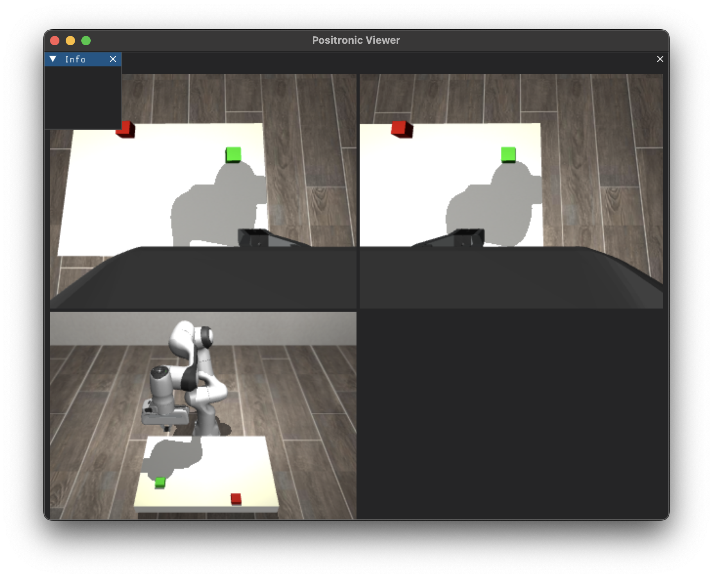
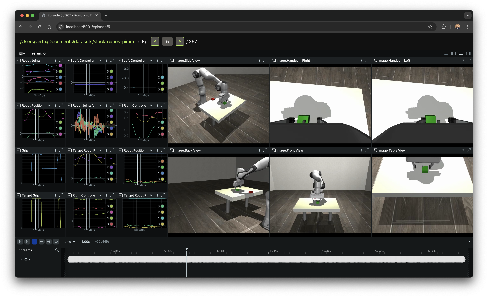

# Data Collection Guide

This guide covers collecting demonstrations in both simulation and on physical hardware using Positronic's data collection tools.

## Overview

Positronic provides a unified data collection interface for simulation and hardware:
- **Simulation**: MuJoCo physics with DearPyGui visualization
- **Hardware**: Franka, Kinova, SO101, DROID platforms
- **Teleoperation**: WebXR (phone/VR), keyboard, gamepad
- **Storage**: Format-agnostic Positronic datasets (Parquet + video)

All demonstrations are recorded as immutable raw datasets that can be projected to any model format using [codecs](codecs.md).

## Quick Start in Simulation

```bash
uv run positronic-data-collection sim \
    --output_dir=~/datasets/stack_cubes_raw \
    --sound=None \
    --webxr=.iphone \
    --operator_position=.BACK
```

This command:
1. Loads the [MuJoCo scene](../positronic/assets/mujoco/franka_table.xml) (Franka arm + table)
2. Starts DearPyGui visualization window
3. Launches WebXR server for phone-based teleoperation (port 5005)
4. Records demonstrations to `~/datasets/stack_cubes_raw`



**Stop the server:** Press `Ctrl+C` when done collecting.

## Teleoperation Methods

### Option 1: Mobile Phone (WebXR)

Both simulation and real robots can be controlled using your phone as a 6-DOF controller.

#### iPhone Setup

1. **Launch data collection** with `--webxr=.iphone`:
   ```bash
   uv run positronic-data-collection sim \
       --output_dir=~/datasets/my_task \
       --webxr=.iphone
   ```

2. **Find host IP**: The data collection script prints the exact URL in console.

3. **Install WebXR-capable browser** on iPhone:
   - **XR Browser** (recommended)
   - **WebXR Viewer** (Mozilla)

4. **Connect to server**: Open browser and navigate to printed URL

5. **Enter AR mode**:
   - Tap **Enter AR** button
   - Grant camera and gyroscope permissions
   - Hold phone upright — the reticle represents the virtual controller

6. **Use on-screen HUD**:
   - **Track** — Start/stop positional tracking (maps phone movement to robot)
   - **Record** — Start/stop episode recording
   - **Reset** — Abort current recording and reset scene
   - **Gripper slider** — Control gripper width (0-1)

#### Android Setup

1. **Launch with `--webxr=.android`**:
   ```bash
   uv run positronic-data-collection sim \
       --output_dir=~/datasets/my_task \
       --webxr=.android
   ```

2. **Use Chrome browser** (WebXR supported out of the box)

3. **Connect** to `https://<host-ip>:5005` (note **https**)

4. **Enter AR** and control as described above

#### Troubleshooting Phone Control

**"Enter AR" button not appearing:**
- Browser doesn't support WebXR — try XR Browser (iPhone) or Chrome (Android)
- Try toggling HTTPS: `--webxr.use_https=True` or `False`

**Tracking is jittery or unresponsive:**
- Ensure good lighting for AR tracking
- Hold phone steady while pressing **Track** to calibrate
- Reset tracking with **Reset** button if alignment is off

**WebXR server not accessible:**
- Check firewall allows connections on port 5005
- Verify phone and computer are on same network
- Try explicit IP address instead of hostname

### Option 2: VR Headset (Meta Quest / Oculus)

1. **Launch with `--webxr=.oculus`**:
   ```bash
   uv run positronic-data-collection sim \
       --output_dir=~/datasets/my_task \
       --webxr=.oculus
   ```

2. **Find host IP**: The script prints the exact URL in console

3. **Connect headset to same network** as host machine

4. **Open Oculus Browser** in headset

5. **Navigate to `https://<host-ip>:5005/`**:
   - Browser may show "Dangerous connection" warning
   - Oculus browser will say it's "dangerous to proceed"
   - Click Advanced → Proceed to site
   - This is expected with self-signed HTTPS certificates

6. **Click "Enter AR"** and approve permission dialog

7. **Controller mappings**:
   - **Right B** — Start/stop recording (audio cues if sound enabled)
   - **Right A** — Toggle positional tracking (aligns controller with robot)
   - **Right stick press** — Abort episode and reset scene
   - **Right trigger** — Analog gripper control

8. **Optional video streaming**:
   ```bash
   uv run positronic-data-collection sim \
       --output_dir=~/datasets/my_task \
       --webxr=.oculus \
       --stream_video_to_webxr=wrist_camera
   ```
   Shows wrist camera feed in VR (camera name must match config)

## Data Collection Workflow

### Step-by-Step Example (Phone or VR)

1. **Start tracking** — Press **Track** button (or Right A on VR controller)
   - Controller now controls robot end-effector in 3D space

2. **Start recording** — Press **Record** button (or Right B on VR)
   - Episode recording begins
   - Audio cue plays if sound enabled

3. **Perform task** — For example, "stack green cube on red cube":
   - Move controller to green cube
   - Open gripper (slide to 1.0 or release VR trigger)
   - Approach and grasp cube
   - Close gripper (slide to 0.0 or squeeze VR trigger)
   - Move to red cube
   - Place green cube on top
   - Open gripper to release

4. **Stop recording** — Press **Record** button again (or Right B)
   - Episode is saved
   - Audio cue plays

5. **Reset scene** — Press **Reset** button (or Right stick press on VR)
   - New random scene generated (cube positions randomized)
   - Robot returns to home position

6. **Repeat** for multiple demonstrations

7. **Abort failed recording** — Press **Reset** during recording
   - Current episode discarded
   - Scene reset

### Collection Best Practices

**Quality over quantity:**
- Record a few calibration runs first
- Review in Positronic server (`uv run positronic-server --dataset.path=~/datasets/my_task`)
- Delete bad demonstrations before starting full collection
- Restart episode if something goes wrong, don't save partial data

**Data requirements:**
- **Minimum**: 30 demonstrations (policy may not learn reliably)
- **Recommended**: 50+ demonstrations for single-task scenarios
- **Multi-task**: 100-500+ demonstrations depending on task diversity

**Demonstrate variation:**
- Randomize object positions (use **Reset** between episodes)
- Show different approach angles
- Vary grasp positions slightly
- Include both successful and near-failure cases (but not catastrophic failures)

**Monitor during collection:**
- Watch DearPyGui window to confirm camera feeds update
- Check robot state visualizations (joint positions, EE pose)
- Verify gripper commands are captured correctly

**Episode management:**
- Keep demonstrations short (10-30 seconds typical)
- One task per episode (don't concatenate multiple subtasks)
- Consistent start and end states help learning

## Hardware Configurations

Positronic supports multiple hardware platforms with the same data collection interface.

### Franka Panda (7-DOF)

```bash
uv run positronic-data-collection real \
    --output_dir=~/datasets/franka_kitchen \
    --webxr=.oculus \
    --operator_position=.FRONT
```

**Hardware requirements:**
- Franka Panda arm with FCI (Franka Control Interface)
- Gripper (Franka Hand or compatible)
- Network connection to robot controller
- Cameras (RealSense, Azure Kinect, etc.)

**Setup:**
- Install hardware extras: `uv sync --frozen --extra hardware` (Linux only)
- Configure network connection to robot controller
- Provision udev rules for cameras (see [Drivers](../positronic/drivers/))

### Kinova Gen3 (7-DOF)

```bash
uv run positronic-data-collection real \
    --output_dir=~/datasets/kinova_tasks \
    --robot_arm=@positronic.cfg.hardware.roboarm.kinova
```

Override default Franka config with Kinova arm configuration.

### SO101 Platform

```bash
uv run positronic-data-collection so101 \
    --output_dir=~/datasets/so101_runs \
    --webxr=.iphone
```

SO101 configuration preset for Stanford/Aloha-style bimanual setup.

### DROID Platform

```bash
uv run positronic-data-collection droid \
    --output_dir=~/datasets/droid_runs
```

DROID platform with joint-space control (7-DOF arms + grippers).

## Configuration and Customization

### Common Parameters

| Parameter | Description | Example |
|-----------|-------------|---------|
| `--output_dir` | Dataset save location | `~/datasets/my_task`, `s3://bucket/datasets/task` |
| `--webxr` | Teleoperation frontend | `.iphone`, `.android`, `.oculus`, `None` |
| `--sound` | Audio feedback | `None` (disable), default (enable) |
| `--operator_position` | Camera viewpoint in sim | `.FRONT`, `.BACK`, `.LEFT`, `.RIGHT` |
| `--stream_video_to_webxr` | Camera feed to VR | `wrist_camera`, `exterior_camera` |

### S3 Support

Record directly to S3 (data cached locally and synced automatically):

```bash
uv run positronic-data-collection sim \
    --output_dir=s3://my-bucket/datasets/stack_cubes \
    --webxr=.iphone
```

Positronic relies on [pos3](https://github.com/Positronic-Robotics/pos3) for S3 integration.

### Inline Overrides

Override any config value inline using `--path.to.config=value`:

```bash
uv run positronic-data-collection real \
    --output_dir=~/datasets/custom_task \
    --robot_arm=@positronic.cfg.hardware.roboarm.kinova \
    --webxr=.iphone \
    --operator_position=.FRONT \
    --sound=None
```

### Custom Configurations

Add new hardware configs under [`positronic/cfg/hardware/`](../positronic/cfg/hardware/):

```python
# positronic/cfg/hardware/roboarm.py
@cfn.config
def my_custom_arm():
    return MyCustomArmDriver(
        host='192.168.1.100',
        port=1234,
        # ... custom parameters
    )
```

Reference with `--robot_arm=@positronic.cfg.hardware.roboarm.my_custom_arm`.

## Reviewing Collected Data

### Positronic Server

Launch the web viewer to inspect episodes:

```bash
uv run positronic-server \
    --dataset.path=~/datasets/my_task \
    --port=5001
```

Open browser to `http://localhost:5001` to:
- Browse all episodes
- View camera feeds and robot state
- Check signal timestamps and synchronization
- Identify low-quality demonstrations for deletion



### Manual Curation

Currently, curation is manual:
- Mark low-quality runs while watching
- Delete episode directories manually: `rm -rf ~/datasets/my_task/000000000000/000000000042/`
- Future releases will support in-viewer curation

### Dataset Statistics

Check dataset info:

```bash
# Episode count
ls ~/datasets/my_task/000000000000/ | wc -l

# Total size
du -sh ~/datasets/my_task/

# Signal metadata
cat ~/datasets/my_task/000000000000/000000000000/meta.json
```

## Troubleshooting

### WebXR "Enter AR" fails

**Cause:** Self-signed HTTPS certificate warning

**Solution:**
- Browser may show "Dangerous connection" warning
- Oculus browser will say it's "dangerous to proceed"
- Click Advanced and proceed to site
- This is expected with self-signed HTTPS certificates

## Next Steps

After collecting demonstrations:

1. **Review data** in Positronic server
2. **Curate dataset** by removing failed demonstrations
3. **Convert to model format** using codecs ([Training Workflow](training-workflow.md))
4. **Train policy** with your chosen model ([Model Selection](model-selection.md))
5. **Evaluate** with inference ([Inference Guide](inference.md))

## See Also

- [Training Workflow](training-workflow.md) — Converting and training on collected data
- [Codecs Guide](codecs.md) — Format-agnostic projection to model formats
- [Inference Guide](inference.md) — Deploying trained policies
- [Dataset Library](../positronic/dataset/README.md) — Raw format storage and transforms
- [Drivers](../positronic/drivers/) — Hardware integration details
