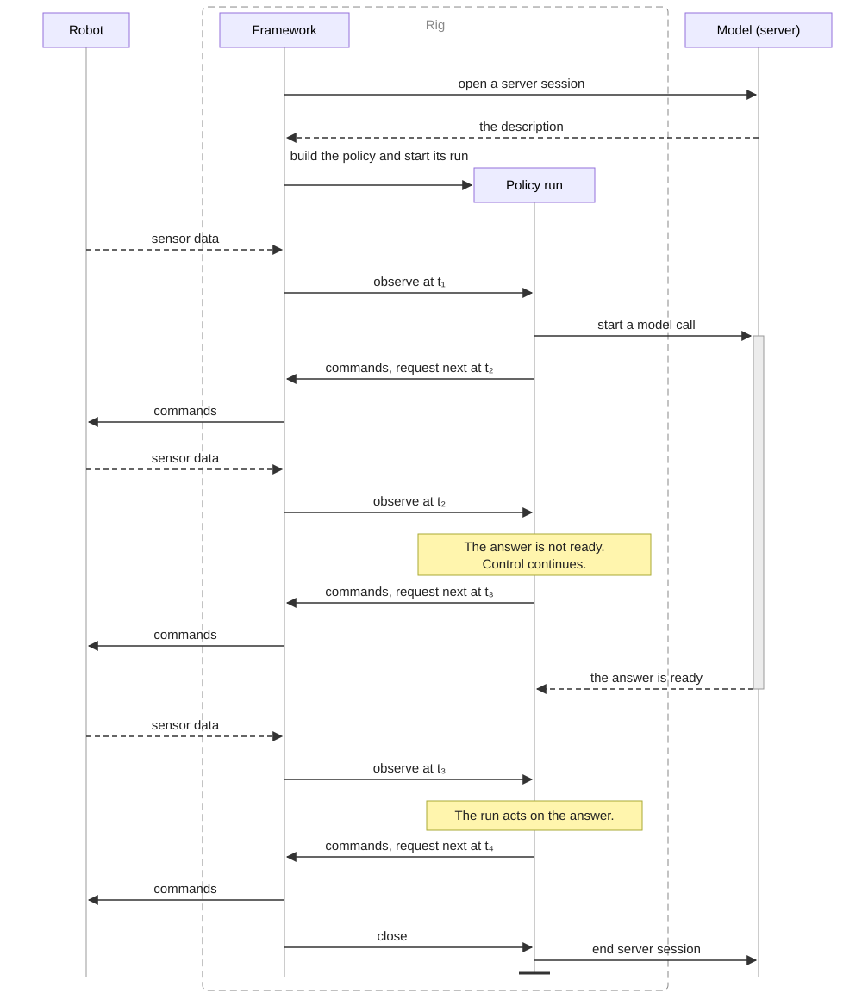
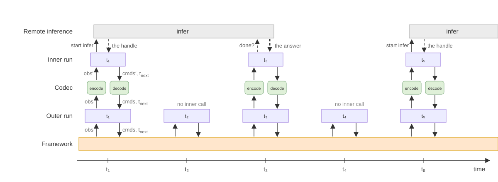

# Positronic Policy API

This document walks through Positronic's policy API design, including the
reasoning that shaped it and the API itself.

## Introduction

AI changed how software is built. Hand-written code gave way to
general-purpose models. An agentic system has three parts — a model that
decides, tools that act, and a harness that connects the two. Both
interfaces are standardized. The harness reaches any model through the same
completions API, and calls any tool the same way, whether the tool is a
shell command, an MCP server, or a third-party service. The standards make
the parts interchangeable. Any model works with any tools, and swapping one
never touches the other.

Robotics has no such architecture. AI already makes decisions on robots, but
each stack binds one model to one robot with bespoke code — the way software
was bound to hardware before operating systems decoupled them. Moving a model
to a new robot, or giving a robot a better model, usually requires bespoke
integration.

In Positronic Robotics our goal is to let any AI model control any robot, in
simulation and in reality. The person with a problem picks the model and the
robot, and the two connect. The two "any"s rule out hand-wiring — nobody
writes a control loop per model per robot per world. The goal requires a
single interface between models and robots, and this document designs it.

This interface is harder to design than the ones digital AI settled on. A
model-call API describes a request and its answer; it does not describe what
the robot should do while waiting. A robot is inherently asynchronous: the
world keeps moving while the model thinks, so an answer arrives to a world
that has already changed. Sensors run at their own rates, data lags or arrives unevenly, and
a command takes time to execute. Robots themselves are diverse, with
different bodies, different sensors, different command languages, different
control strategies. The model is heavy and usually runs on another machine,
while the robot must be controlled here and now. And a physical episode
cannot be re-run: understanding what happened relies on what was recorded,
across every machine involved.

Simulation is hard for the opposite reason. The rig's world is messy, and
the simulator's world is too tidy — synchronous, deterministic, time under
the program's control. Policies are tested in simulation before they reach
a robot, and a policy that can sense this tidiness comes to depend on it
and loses it on the robot. So the API must not reveal which world it runs
against, and the framework must be able to charge a model call's real
duration to simulated time.

The rest of the document is the design: the goals, where existing
interfaces fall short, the design decisions, and the API itself.

## Goals

- **Expressive.** A model call is slow while the robot keeps moving, and how
  a policy bridges that — executing the previous chunk, blending a late plan
  into the motion underway, choosing when to re-plan — is where policies
  differ most. New schemes appear constantly and each must fit without a
  framework change.
- **Any robot.** The API assumes nothing about the robot: what a policy
  must know about its body reaches it as data, so a new robot is new data,
  not a new API.
- **Any world.** To a policy, simulation and the real robot are the same
  world: the same control code runs in both, and model calls consume world
  time when inference time is charged. Uncharged simulation is an explicit
  evaluation option.
- **Composable.** Building a new policy must be easy: a policy is assembled
  from parts written once, so a developer writes only what is new.
- **Remote-native.** Heavy computation wants its own machine, while control
  runs best close to the sensors and the robot. A policy therefore spans
  machines, and the API and the framework must make that split easy.
- **Debuggable.** An episode cannot be re-run, so understanding it relies on
  what was recorded. The goal is to reconstruct from the records alone what the
  policy saw, what it decided, and what it asked of its model — even when
  those happened on different machines. [Recording and logging](#recording-and-logging)
  distinguishes the implemented recording from this goal.

## Existing interfaces

Robot policies are already served over the wire. Physical Intelligence's
openpi server (also behind RoboArena), NVIDIA's GR00T inference service,
LeRobot's serving stack and academic platforms like XPolicyLab all share
the same shape - the client sends observations, the server returns a chunk
of actions, and the client runs the loop. This shape traces back to
the gym environment loop — `action = policy(obs); obs = env.step(action)` —
where the world truly waits while the policy thinks. A robot's world keeps
moving, and the interface cannot express what that demands:

- Act while thinking. Between request and reply the policy cannot see or
  do anything. A policy that watches the force sensor and freezes the arm
  while its model computes cannot be written.
- Choose the next moment. The client asks on a schedule of its own: every
  k steps, or when the action queue drains. A policy that wants to re-plan
  early because the object slipped has no way to ask for that.
- Know the time. Chunks are timestamped by presuming a fixed control
  period, latency is measured and then only logged, and in simulation
  thinking is free. The policy never learns how stale its observations are
  or when its answers take effect.

LeRobot's hand-written inference thread, openpi's blocking chunk client and
hand-tuned replan constants are all patches around these limits, written
again at every robot.

This design starts from the moving world instead. A policy acts, watches
and paces itself in it, so the list of expressible schemes has no end: the
next idea fits without a new interface.

## Design

### The life of an episode

The code on the rig connects to a policy server and receives a description of its pieces —
which run near the robot and which stay remote. It assembles the local
half: a chain of parts that transform observations on the way to the
model and commands on the way back.

An episode begins, and the assembled half becomes a run — the
running instance of the policy that controls this robot for this
episode. The framework resumes the run repeatedly, sending the sensor
data. The run reads world time from its runtime. Every resumption yields
commands and the time of the next call. The framework sends the commands
to the robot immediately.

The run holds the control state the episode remembers between calls. This
state lives on the rig: a reaction that crosses a wire arrives late,
and when the network fails it does not arrive at all.

The model is heavy: it needs a GPU and a machine of its own, and the rig
rarely has them. Heavy pieces stay remote. The model is also too slow for
this loop, so the run submits the model call and yields control while it
executes. The policy can continue to control the robot and acts on the
answer when it arrives. After the setup, the server only answers these
calls. A stateless model answers from its arguments alone; a stateful model
keeps its history in a server session tied to the policy run's lifetime.

The framework records sensor and executed-command signals, along with timing
logs. Recording inputs and outputs at every policy and inference boundary is
part of the debugging goal. The episode ends when the framework closes the
run and its server session. The record remains.



The sections below describe each piece.

### Processors and runs

One algorithm may drive several robots at once.

- A processor is a reusable computation definition. It holds configuration;
  each run holds its own state between inputs.
- A policy is a processor that receives observations and produces commands
  together with the time it wants to be called next.
- Several runs of the same definition can exist independently, each remembering
  its own episode.
- The runtime starts a run and prepares it to receive input. Each resumption
  supplies an input and gets an output back.
- The framework receives a complete policy definition, creates one runtime per
  episode, and starts the policy. The definition resolves its own dependencies;
  child runs share the runtime and receive their dependencies explicitly.
- Whoever starts a run is responsible for closing it and the resources it owns.
  Submitted work must finish before those resources close. Closure happens
  between resumptions, never while the run is processing an input.

For readers familiar with [PyTorch modules](https://docs.pytorch.org/docs/stable/generated/torch.nn.Module.html),
the composition idea is similar: a component can call other components as part
of its computation. Runs give episode state an explicit lifetime: the same
processor definition can start separate runs, each with its own history and
pending work. This separation lets us reuse the definition without sharing
one robot's episode state with another.

### Control

The robot moves continuously, but code acts in moments. The framework
connects the two with signals, a concept from
[pimm](../../pimm/README.md), Positronic's runtime. A signal is a single
value that its owner updates at its own rate. A reader takes the latest
value whenever it looks. Nothing queues and nothing waits.

The policy run is a reader of observations and a writer of commands.
Everything around it is asynchronous, but each resumption is synchronous:
the run processes an observation and returns control to the framework.

- Each resumption receives observations and produces commands to execute now
  (possibly none), together with the requested time of the next call.
- Observations contain the latest available sensor values, task, and rig descriptor.
  They form a read-only snapshot: later sensor updates must not change an earlier
  input. Current time comes from the runtime, separately from observations.
- Returned commands are emitted towards the robot driver immediately.
- Observations and commands are named channels. A channel value can be
  of any type, structured or unstructured (a robot command, an image).
- The episode clock never goes backwards. A completion can cause another
  call at the same time and tick, but with any newly received sensor values.
- The requested next call time is how the policy paces itself: the instant
  at which it wants to be called next, absolute on the episode clock.
- The framework calls best-effort at that time: it may be earlier or later,
  and the run reads the actual moment from the runtime.

Every newly available submitted answer also schedules a call through the whole
policy stack. Each completion prompts a call once, independently of whether
its result has been read.

Playback belongs to the policy; the framework emits its commands immediately.
For example, a scheduling processor can play an action chunk before requesting
another, a fault guard can withhold commands, and a history processor can collect
sensor samples while inference is pending. These are composable policy choices.

### Submitted work

The policy defines its heavy work, such as model inference, as ordinary
functions. Submitting a function to the runtime returns at once — control
continues while the submitted work runs locally or calls a GPU server. The
framework measures the call's duration so charged simulation includes its
real latency.

- Any ordinary function can be submitted: image processing, a model call, or
  other computation. A remote call is simply a function that uses a connection.
- Submitted functions must not mutate the run's episode state. Their inputs
  must also remain unchanged until the call finishes. The framework does not
  enforce this restriction; callers must copy buffers they need to reuse.
- Submission returns an answer handle. The run can check it without waiting
  when it next has control. Reading a result before it is available on the
  episode clock raises an error.
- If a call raises — for example, on a lost connection or a value that does
  not serialize — reading its result raises the failure. A call that never
  finishes can leave its handle pending indefinitely.
- The re-raise is best effort. A failure that crossed the wire loses its
  class and can arrive as a different type. A run must not select its
  behavior by the class of a function error.
- A run may cancel a call it will not read. Queued work can be cancelled;
  a call that already runs may run to its end. Cancellation does not undo
  server-side effects.
- A remote function's inputs and outputs must be supported by its transport.
- A run computes only during its resumption or inside a submitted function.

Real execution exposes finished answers immediately. Charged simulation exposes
them only when simulated time includes their queueing and execution duration.
Uncharged simulation waits for completion before advancing time. An unlimited chain of
uncharged submissions can therefore keep the simulator at one instant.

### Composability

A neural policy is never just the model. Data transforms surround it —
normalize, change frames, encode actions — the pre- and post-processing
every ML pipeline has. Physical AI adds a second kind of part, one that
works in time: decide when to call the model, execute the actions it
returned, blend a late plan into the motion underway. The API gives each
kind its own shape. A codec transforms data and does not see time. A
processor can keep state in its run and use the episode clock.



- Sequential composition nests components from outermost to innermost. It is
  itself a processor definition; starting it creates the component runs.
- Dependencies are supplied explicitly when starting a run: live child runs or
  ordinary callables. Sequential passes each child to the component outside it.
- The parent decides what input its child receives, whether to call it, and
  how often. A custom processor may use several children. Calls at the same
  clock time are allowed; code must not assume a positive time step.
- Runs share the episode runtime. Each reads the clock when it needs it;
  real time continues to pass while synchronous code executes.
- A codec is a pair of transforms — encode and decode, as in a video
  codec. Around an inference function, encode converts the arguments and decode
  converts the answer. Around a policy run, encode converts the observations
  going down and decode converts commands coming up, leaving the requested next
  call time untouched. An empty command mapping emits nothing.
- Codecs and processors can mix anywhere in a sequence. Context-dependent
  decoding belongs around the inference callable so it uses that call's input;
  a codec around the scheduler sees the current control input.
- Codecs also compose sequentially, feeding one transform into another, or in
  parallel, merging their outputs. They do not attach action timestamps.

Sequential and codecs are offered, not imposed: a policy may always implement
its run directly.

Processors report metadata about their definitions. A composition combines its
components' metadata. Metadata specific to a run is deferred.

### Remote policies

Execution splits between the rig and the server. The definition does not:
the processors and codecs on the rig belong to the same design as the functions
behind the wire, and halves defined apart drift apart. The server owns the
whole definition and sends it to the rig as a description.

- The server describes the client stack using registered components and their
  configuration. A component can run locally without supporting delivery over
  the wire, but the server can only declare components the client understands.
- The protocol and individual components have separate versions. A new client
  supports older servers through explicit compatibility rules. Unsupported
  declarations fail before inference rather than silently changing behavior.
- Deprecation gives users notice and a migration path before a later client
  release removes support. Installed clients do not expire by date. The
  [wire compatibility rules](../offboard/README.md#compatibility-and-deprecation)
  define the details.

Each remote run opens a server session and runs the declared client stack
around an ordinary inference function. The session identifies that run's calls
and owns any server-side episode state. It ends when the run closes or the
connection is lost, after outstanding calls finish using its resources.

A session does not require the model to be stateful. Stateless models can serve
several sessions without keeping episode history. Stateful models must keep
each session's history separate or reject overlapping sessions. Ending a session
releases its episode state, not the shared loaded model.

A server deployment brings together the model to load, the client stack, and
any data conversion performed on the server. Loading and serving models belong
to the server; the policy run sees an ordinary function call. See the
[offboard interfaces](../offboard/spec.py) for the server configuration types.

### Recording and logging

A system split between a rig and a server is hard to debug. Data flows
in two dimensions — through time and through the layers — and the
goal is for the recording to reconstruct both flows after the episode:
what each part saw, what it returned, and when. That includes inference inputs
and outputs on other machines, and values a run chooses to record itself.

The framework records sensor and executed-command signals as an episode dataset.
Inference input/output recording, custom run recording, and per-run metadata
are deferred.

Timing is part of logging: framework spans cover processor resumptions, codecs,
and submitted jobs, with parent-child links. The outermost processor span times
the whole policy call; suspended generators keep no span open. Background jobs
remain children of the call that submitted them. These are wall-clock timings,
independent of simulation charging. Parent durations include synchronous children
and should not be added to them.

## API

The core interfaces below are abridged from [base.py](base.py),
[sequential.py](sequential.py), and [codec.py](codec.py).

### The policy step

```python
# Observations and commands are named channels.
Obs = Mapping[str, Any]
Commands = Mapping[str, Any]


@dataclass
class Step:
    commands: Commands
    resume_at_ns: int


# Keep input first in both Processor and ProcessorRun.
ProcessorRun = TypeAliasType(
    'ProcessorRun', Generator[OutputT | None, InputT, None],
    type_params=(InputT, OutputT),
)
PolicyRun = ProcessorRun[Obs, Step]
```

The runtime primes a generator to its first yield, which must be `None`.
After that, sending an input returns its next output. A policy run must yield
a step for each observation.

### Answers

```python
class Answer(ABC, Generic[T]):
    def done(self) -> bool: ...

    # Returns the result, re-raises the failure, or raises NotAnswered before done().
    def result(self) -> T: ...

    # Cancel queued work where possible; running work may finish.
    def cancel(self) -> None: ...
```

### The runtime

```python
# One runtime shared by the runs in an episode.
class Runtime(ABC):
    @property
    def time_ns(self) -> int: ...

    @property
    def tick(self) -> int: ...

    def start(
        self, processor: Processor[InputT, OutputT], /, *args: Any, **kwargs: Any
    ) -> ProcessorRun[InputT, OutputT]: ...

    def submit(
        self, function: Callable[P, T], /, *args: P.args, **kwargs: P.kwargs
    ) -> Answer[T]: ...
```

### Processors and policies

```python
class Processor(ABC, Generic[InputT, OutputT]):
    def run(self, runtime: Runtime, *args: Any, **kwargs: Any) -> ProcessorRun[InputT, OutputT]: ...

    def meta(self) -> dict[str, Any]: ...

    # Optional for local code; required for a deliverable component.
    def to_spec(self) -> dict[str, Any]: ...


Policy = Processor[Obs, Step]
```

`meta()` reports definition metadata. `to_spec()` declares a registered component
name, version, and plain-data constructor arguments; compositions contain nested specs.

A minimal policy yields no commands and asks to be called in 100 ms:

```python
from positronic.policy.base import Policy, PolicyRun, Runtime, Step


class Hold(Policy):
    def run(self, runtime: Runtime) -> PolicyRun:
        obs = yield
        while True:
            obs = yield Step({}, runtime.time_ns + 100_000_000)
```

### Composition and codecs

```python
class Codec:
    def encode(self, data: dict) -> dict: ...

    # `data` may be a list of commands; the codec decodes each one.
    def decode(self, data: Any) -> Any: ...

    def wrap(
        self, function: Callable[[dict], Any] | ProcessorRun[Obs, Any]
    ) -> Callable[[Obs], Any] | ProcessorRun[Obs, Any]: ...
```

For example, `runtime.start(Sequential(PauseOnUnavailable(), ChunkedSchedule(fps=20)), infer)`
passes the inference callable into the scheduler, and the scheduler's live run
into `PauseOnUnavailable`. The caller sends observations to the returned run.

Codecs compose with `|` for sequential conversion and `&` for parallel conversion.
`Sequential.meta()` flattens and combines component metadata, with later
components winning on shared keys.

Sequential closes the runs it creates. External dependencies remain owned by
their caller. `Codec.wrap` does not take ownership of the child it wraps.

## Deferred, not to decide now

- Plan invalidation and recovery after robot unavailability; [#789](https://github.com/Positronic-Robotics/positronic/issues/789).
- TODO: Let a policy select which answers may wake it early with `wake_on`.
- TODO: Record dropped and late waypoints in the scheduling processor.
- The shape of the robot description, and a server's ability to refuse one.
- Inference input/output recording, custom run recording, and per-run metadata.
- Source times for observations — whether the framework passes the
  timestamp of each sensor value to the run. The pimm signals
  already carry these timestamps.
- The wall-time timeline across machines — the rig clock and the server
  clock differ, and the records from both must align. #528 tracks the
  clock problem in pimm.
